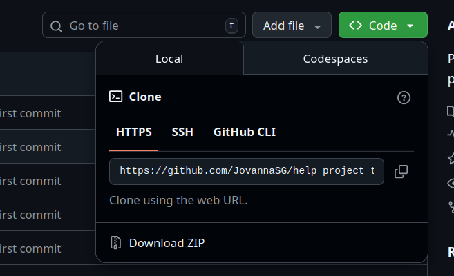

# Как скачать и запустить Telegram-бота на Python

## 📦 Шаг 1: Скачать zip архив

Нажимаем на кнопку **Download ZIP**



Потом распаковываем архив в папку с проектом, где мы создавали простого бота


## 🛠 Шаг 2: Установка зависимостей

Активируйте виртуальное окружение:

```bash
.\.venv\Scripts\activate
```

Установите нужные библиотеки из файла **requirements.txt**

```bash
pip install -r requirements.txt
```

## 🔧 Шаг 3: Настройка окружения

В **.env** файле нужно написать еще одну строчку

```bash
BOT_TOKEN=ваш_токен_бота
CHAT_ID=id_вашего_чата_или_канала
```

### ⚠️ Как получить данные?

**CHAT_ID**: Используйте бота @userinfobot для получения ID чата.